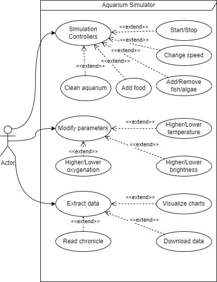
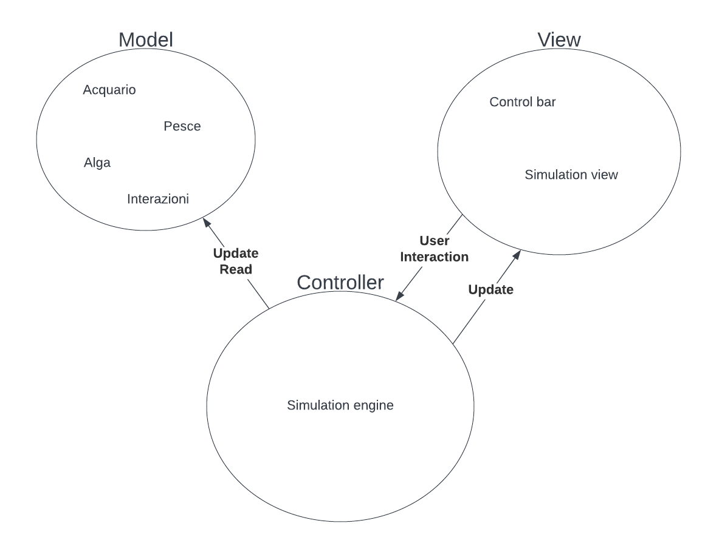
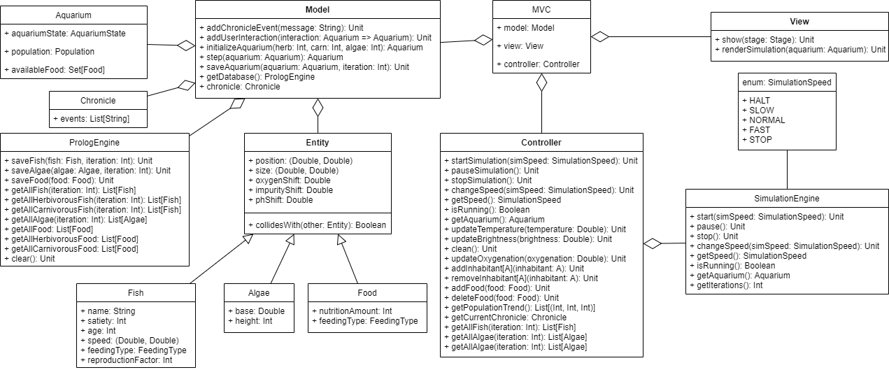
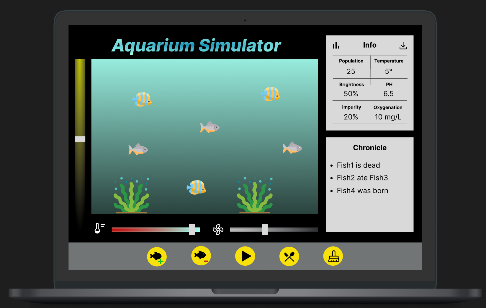
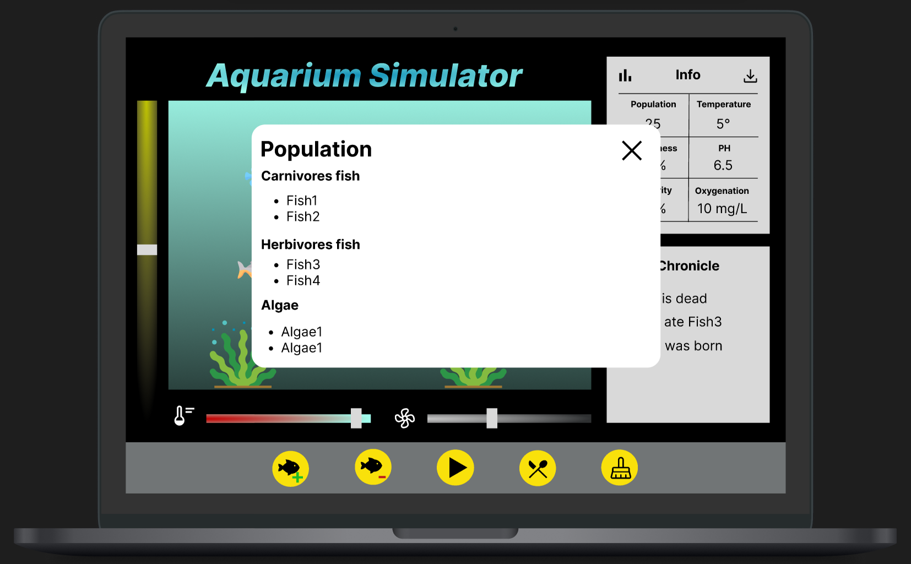
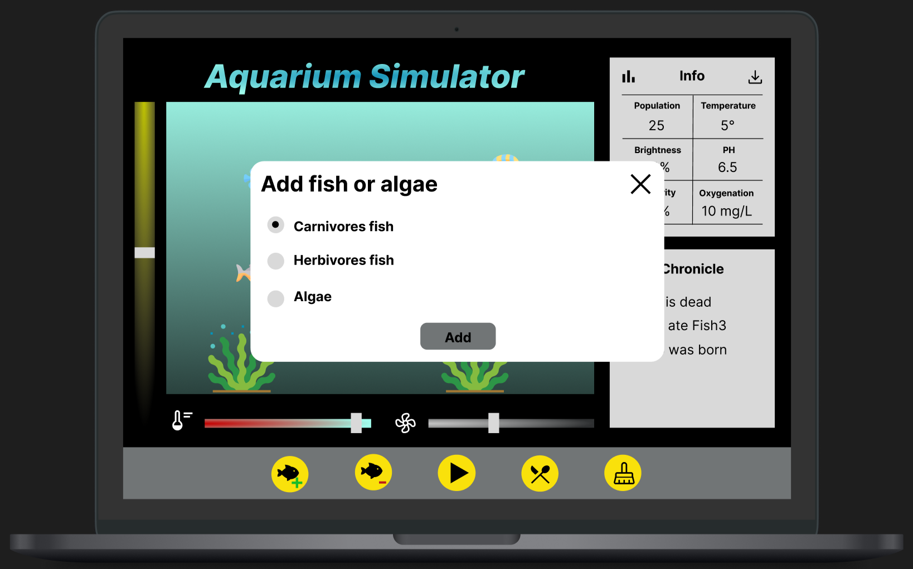
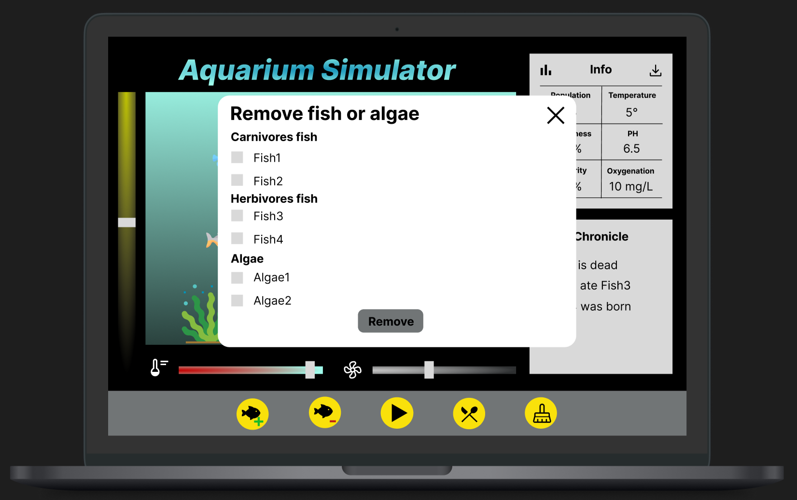
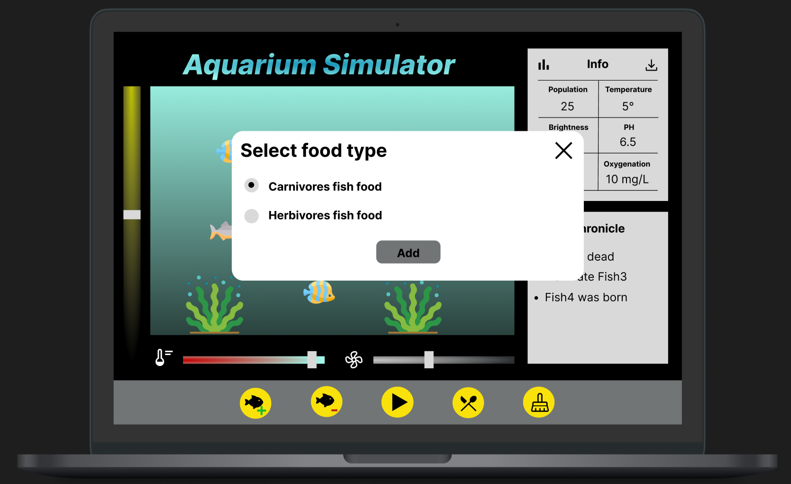

# 4 Design architetturale

## 4.1 Casi d'uso
I casi d'uso vengono usati per definire l'uso dell'applicativo da parte dell'utente, ed è importante considerarli in fase di architettura per creare un sistema adatto alle esigenze.

L'utente dopo aver avviato l'applicazione potrà interagirci tramite determinate azioni, tra cui:
- Controlli sulla simulazione:
  - Start e stop.
  - Cambiare velocità.
  - Aggiungere e rimuovere pesci o alghe.
  - Aggiungere cibo.
  - Pulire l'acquario.
- Modificare parametri della simulazione:
  - Alzare o abbassare la temperatura.
  - Alzare o abbassare la luminosità.
  - Alzare o abbassare l'ossigenazione.
- Estrarre dati dalla simulazione:
  - Visualizzare grafici.
  - Scaricare i dati generati.
  - Leggere lo storico.

## 4.2 Architettura complessiva

Per implementare un'architettura idonea al progetto abbiamo deciso di sfruttare il pattern MVC, separandolo quindi in tre macro componenti: Model, View e Controller. Di seguito uno schema riassuntivo della composizione e interazione dei componenti:

## 4.3 Descrizione del pattern MVC

MVC (Model-View-Controller) è un pattern di design del software comunemente usato per implementare interfacce utente, dominio e logica di controllo. Il punto focale di questo pattern è la separazione tra la logica del software e l'interfaccia dell'utente: tale "separazione di concetti" permette una migliore divisione del lavoro tra gli sviluppatori di un team. Le tre principali componenti di questo pattern sono:
<dl>
	<dt>Model</dt>
	<dd>
		Il Model definisce il modello che l'applicativo è in grado di gestire: in generale si tratta di un componente passivo che supporta la lettura e scrittura da parte del controller, introducendo controlli sulla correttezza dei dati e incapsulando la logica di funzionamento del sistema.
	</dd>
	<dt>View</dt>
	<dd>
		La View definisce l'interfaccia che viene mostrata all'utente: include componenti grafici (scritte, immagini...) per visualizzare lo stato del sistema e componenti di input (bottoni, caselle di testo...) per informare il controller sull'input dell'utente.
	</dd>
	<dt>Controller</dt>
	<dd>
		Il Controller fa da ponte tra il Model e la View e si occupa di aggiornarli opportunamente in risposta all'input dell'utente. Nel nostro caso il Controller gestisce le tempistiche di aggiornamento dei dati del Model per ogni iterazione della simulazione.
	</dd>
</dl>

Il team, nella sua interezza, ha già utilizzato questo pattern in altri progetti, quindi questa scelta rappresentava la soluzione più sicura ed efficiente per realizzare un solido design architetturale per il progetto.

## 4.4 Descrizione dettagliata delle componenti

Qui vediamo le principali classi che strutturano il progetto, mettendo in evidenza i metodi d'interfaccia fra i componenti e la suddivisione in sotto classi:

Il *Controller* ha una classe di supporto *SimulationEngine* che si occupa degli aspetti di gestione della simulazione. Il *Model* è complesso in quanto deve rappresentare il dominio del progetto. Tra le principali classi vediamo:
- *Aquarium*: rappresentante lo stato della simulazione.
- *Entity*: le entità che possono essere inserite nell'acquario, tra cui:
  - *Fish*
  - *Algae*
  - *Food*
- *Chronicle*: per la gestione dello storico.
- *PrologEngine*: per l'accesso in lettura e scrittura dei dati nel db.

## 4.5 Scelte tecnologiche con impatti sull'architettura
Per quanto riguarda **ScalaFX**, per come è implementata la libreria, è stato necessario ridefinire un suo *wrapper* del metodo *main*, portando di fatto l'esecuzione del progetto sul **Thread** dedicato all'interfaccia grafica. Ciò ha necessariamente portato ad implementare la simulazione su un *Thread* diverso creato appositamente, come descritto nel documento "05-implementation" al paragrafo "Simulation engine".

## 4.6 Mockup interfaccia utente

**Interfaccia base**

**Visualizzazione popolazione**

**Aggiunta pesce o alga**

**Eliminazione pesce o alga**

**Selezione tipo di cibo**
