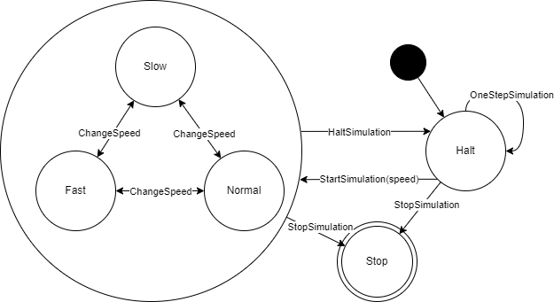

# 4 Analisi dettagliata

### Controlli sul dominio
Abbiamo deciso di evitare l'uso delle eccezioni, strutturando il codice di modo che gli errori causati dal passaggio di parametri errati non porti ad un *crash* totale dell'applicativo, ma bensì vengano gestiti all'interno del codice.
Costruendo il sistema per intero, ci siamo assicurati che la parte di *view* rispettasse il dominio delle funzioni utilizzate, quindi vanificando l'uso delle eccezioni.

## Filippo Benvenuti

### Design MVC
Per una leggibile e idiomatica implementazione del pattern architetturale **MVC** ho pensato di realizzarlo tramite **Cake Pattern**, tale prevede una suddivisione in componenti disgiunti e sostituibili del codice, permettendo di esplicitare dipendenze tra essi specificando di ognuno a quale altro componente può accedere, di fatto ottenendo un forte vantaggio in fase di sviluppo, per cui da un componente potremo accedere solo a quelli di cui ne abbiamo specificato la dipendenza prima, in quanto in caso contrario otterremmo un codice non compilabile.
Tale pattern permette in fase di sviluppo di avere dei limiti impliciti che annullano l'errore umano di bypassare il design dei componenti, portando di fatto un vantaggio in termini di correttezza del dominio del progetto.
Il *cake pattern* si sposa in modo ottimale con il pattern architetturale *MVC*, infatti secondo quest'ultimo bisogna suddividere il codice in tre macro componenti (Model, View e Controller) i quali non dipendono l'uno dall'altro se non tramite l'interfaccia esposta (difatto potendone sostituire l'implementazione uno ad uno senza intaccare quella degli altri componenti) e tra di loro non tutti devono poter comunicare con gli altri (e.g. il controller può invocare model e view, mentre la view può invocare solamente il controller).

### Design simulation engine
Il *simulation engine* è la parte che si occupa della gestione della simulazione, responsabile delle azioni di *start*, *pause* e *speed change*, il suo comportamento è naturalmente descrivibile come *macchina a stati finiti*, il suo diagramma degli **stati** risulta:

Possiamo osservare 5 stati della simulazione:
- Halt: la simulazione è in pausa.
- Running: la simulazione sta procedendo:
  - Slow: velocità lenta, per osservare meglio cosa succede.
  - Normal: velocità normale, per la normale operatività.
  - Fast: velocità veloce, per evitare attese noiose.
- Stop: la simulazione è terminata.

All'apertura dell'applicativo la simulazione parte nello stato di *Halt*, in cui non avanza, quando passiamo in uno dei 3 stati di *Running* essa eseguirà a diverse velocità, in questi stati è sempre possibile cambiare velocità oppure tornare nello stato di *Halt*, da quest'ultimo possiamo far avanzare la simulazione di uno *Step* alla volta ritornando sullo stesso stato, tale meccanismo potrebbe tornare utile per realizzare la visualizzazione della simulazione passo-passo.
Da ogni stato è sempre possibile allo stato *Stop*, nel quale non è più possibile uscire, esso indica che la simulazione è terminata e non può più essere avviata.

### Design prolog engine
**Prolog engine** è il componente che si occupa di interfacciarsi con il *database* scritto in *Prolog*, il suo obiettivo sarà quello di esporre tutte le operazioni effettuabili sul *db* tramite un'interfaccia comoda da usare, di fatto nascondendo tutta la logica di accesso ai dati ed elaborazione di essi per trasformarli in oggetti utilizzabili.
Il principale vantaggio di prevedere l'esistenza di questo componente la si trova nella leggibilità e ordine del codice prodotto, sommato ad un concetto di incapsulazione che rende l'accesso ai dati più sicuro e intuitivo.

## Elisa Albertini

### Design acquario

UML del design dell'acquario

Parlando del design dell'**acquario** ho scelto di strutturarlo in modo che fosse più modulare possibile. Questo permette, in un secondo momento, di lavorare singolarmente con le sue componenti e aggiungerne di nuove in caso si voglia ampliare la simulazione.
Le principali componenti sono la **popolazione**, nel nostro caso specifico composta da pesci erbivori, carnivori e alghe, il suo **stato**, composto da temperatura, luminosità, ph, livello di impurità e livello di ossigenazione, e il **cibo disponibile**. Dato che popolazione e stato dell'acquario sono due componenti più complesse, sono state realizzate come due classi separate, poi incapsulate all'interno dell'acquario.
 
Le componenti risultanti sono state *Aquarium*, che ha come proprietà *Population*, *AquariumState* (due classi a sé stanti) e che contiene anche il cibo disponibile.
 
Dato che ogni componente, compreso il cibo, richiede determinate funzionalità, ognuno di essi implementa delle interfacce che le forniscono. 
* *Population* implementa due differenti interfacce, una che modella la popolazione di pesci e fornisce i metodi che li restituiscono differenziati per tipo di alimentazione, e una che fornisce i metodi per aggiungere e togliere abitanti nell'acquario.
* *AquariumState* implementa un’interfaccia che fornisce i metodi per modificare i parametri dell'acquario.
* *Aquarium* implementa due interfacce che forniscono metodi per la gestione del cibo. Una modella il cibo disponibile e fornisce i metodi che lo restituiscono differenziato per tipo, mentre la seconda fornisce i metodi che permettono di andare ad aggiungerne e toglierne.
 
Tutti i metodi e le classi sono stati realizzati seguendo i principi della programmazione funzionale. Questo sarà approfondito più in dettaglio nel capitolo di implementazione.

### Design interazioni

UML della factory di interazioni

Una parte fondamentale della simulazione sono le interazioni fra i componenti dell'acquario.
Dopo un'attenta analisi dei requisiti sono state definite le principali:
* Pesce che interagisce
    * con un pesce
    * con un'alga
* Entità (pesce/alga/cibo) che interagisce con lo stato dell'acquario
* Stato dell acquario che interagisce
  * con un pesce
  * con un'alga
 
 Il numero elevato di combinazioni, ovviamente, porta a dover realizzare un gran numero di differenti implementazioni. Queste, per quanto possano essere differenti fra loro, hanno una struttura comune che può essere modellata da un'unica interfaccia. Questo mi ha portato alla realizzazione di una **factory di interazioni**. 
 
Factory è un **design pattern creazionale** che permette di definire l'interfaccia per creare un oggetto ma delega la creazione dello stesso alle sottoclassi che la implementano.
Come benefici questo porta a ridurre al minimo le ripetizioni e la complessità del codice. Questo pattern permette anche, in un secondo momento, di aggiungere ulteriori implementazioni senza dover modificare il design del sistema.
 
Detto questo, l'interazione è stata modellata tramite l'interfaccia *Interaction* che espone un metodo che se chiamato ritorna il risultato dell'interazione fra due componenti. Dato che ogni specifica interazione ha un diverso tipo di ritorno, l'interfaccia è di tipo generico, in modo che sia poi la specifica implementazione a definirlo.

## Emanuele Lamagna

### Design *chronicle*

### Design view