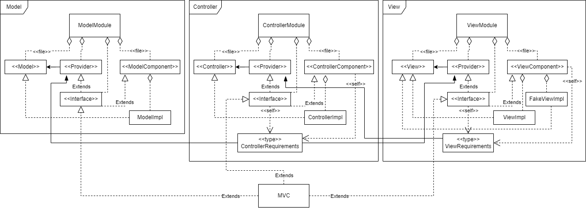

# 5 Implementazione

### Stile d'implementazione
Il team si è impegnato nel cercare di produrre codice, per quanto possibile, aderente allo stile di programmazione funzionale, in particolare utilizzando classi e oggetti immutabili, attraverso metodi che non contengono *side effects* al loro interno.
Durante la scrittura del codice si è cercato di rispettare il più possibile i principi DRY e KISS, assieme ai *SOLID principles*:
- SRP: Single responsibility principle
- OCP: Open/closed principle
- LSP: Liskov’s substitutability principle
- DIP: Dependency inversion principle

Dove abbiamo pensato potesse essere utile utilizzare un *pattern* di progettazione, ci siamo impegnati ad implementare rispettandolo, creando codice di qualità e facilmente comprensibile.
Ci siamo avvalsi il più possibile delle funzionalità di Scala, come:
- Match case
- Currying
- Given instances
- Higher order function
- Type class
- Case class
- Objects
- ...


## Filippo Benvenuti

### MVC
**MVC** è la parte di progetto che si preoccupa d'implementare il pattern *MVC*, considerando l'affinità con **Cake pattern** come pattern di progettazione, ho deciso che quest'ultimo sarebbe stato il miglior modo per unire tutti i concetti messi in gioco, di seguito una spiegazione breve ma efficace delle parti principali.
Partendo dalla macro visione sull'implementazione del codice abbiamo:



Una prima suddivisione in tre componenti, racchiusi ognuno dentro al proprio *Module*, tenuti assieme dall'*object* *MVC* e in relazione tra loro tramite i *Requirements*.
Nell'uso delle frecce ho tentato di seguire il più possibile la semantica di **UML**, in alcuni casi però ho dovuto aggiungere *keyword* per rappresentare al meglio alcuni dettagli e concetti relativi a scala, come:
- file: indica che l'interfaccia è contenuta nell'oggetto a cui punta, ma che il codice è scritto in un file separato da quello del contenitore.
- type: indica una **class type**.
- self: indica che l'interfaccia da cui parte la freccia ha un **self type** composto dalla *class type* verso cui punta.
 
La suddivisione in file diversi non è casuale, come vedremo nel dettaglio questa scelta a portato alla netta separazione tra il gravoso **boiler template** del *Cake pattern* e l'implementazione delle classi, di fatto creando un codice portabile in altri progetti, trasformando in un certo senso il *Cake pattern* in una libreria per la gestione di *MVC*.

La complessità dei tre componenti non è poca, ma notiamo che la struttura è simile e replicabile per tutti e tre, analizziamo allora solamente il *ViewModule* che è il più completo, il punto d'ingresso è il *trait* **Interface**, questo mette a disposizione l'accesso alla *View* ed integra l'uso del componente tramite alcuni particolari meccanismi:
- Estendere **Provider**: un *trait* contenente un *val* di tipo *View*, l'interfaccia dove sono definiti i metodi per comunicare con la *GUI*, questo ci indica che tramite *Interface* è possibile accedere alla *View*, poi vedremo perchè in questo caso è comodo avere il riferimento alla *View* in un *trait* separato.
- Estendere **ViewComponent**: un *trait* contenente le effettive implementazioni di *View*, in questo caso due: **ViewImpl** per il normale funzionamento del progetto e **FakeViewImpl** che non invoca alcuna *GUI* consentendo il *testing* anche su *container* come quelli usati per la *continuous integration*. Grazie a questa struttura, al momento della creazione di *MVC* è possibile scegliere quale implementazione usare semplicemente istanziando l'una o l'altra. Inoltre ha un *self type* su *ViewRequirements* che analizziamo al prossimo punto.
- *Self type* con **ViewRequirements**: questa è una *class type* contenente i componenti a cui si può accedere dalla *View*, in questo caso per la natura di *MVC* essa può vedere solamente il *Controller*, questo viene fatto richiedendo la presenza del *Provider* del *Controller*. Da notare che il *self type* ci permette di utilizzare i metodi dell'interfaccia in questione, senza fornirne una vera implementazione, ma rimandando il dovere di farlo a chi ci implementa, questo è il meccanismo col quale riusciamo a creare dipendenze fra i componenti di *MVC* in modo agevole, evitando errori a *run time* dovuti a chiamate ricorsive tra componenti.

MVC infine estende le *Interface* dei tre componenti, poi facendo **override** delle *val* di *Model*, *View* e *Controller* ne fornisce un'implementazione passando dai rispettivi *Component*, di fatto soddisfando i *self type* di cui abbiamo parlato sopra.
Lato *testing* è bastato creare un **FakeMVC** che implementasse *FakeViewImpl* al posto di *ViewImpl* per poter testare senza creare un'effetiva *GUI*.

### Simulation engine
La parte principale del **Simualtion engine** risiede nella gestione della simulazione, in particolare possiamo concentrarci sull'implementazione del **loop**, essa è rinchiusa nell'uso di un iteratore infinito, al quale viene passato lo stato iniziale dell'*Aquarium*, ad ogni iterazione esso invoca il metodo *step* che dato un *Aquarium* ne restituisce la versione aggiornata al passo dopo della simulazione.
Per evitare di eseguire tutti i calcoli relativi alla simulazione all'interno del **Thread** dedicato all'interfaccia grafica, in modo da non bloccarla mai, ho scelto di usare un *Thread* a parte creato all'apertura dell'applicazione: in questo modo per decidere la velocità di esecuzione della simulazione è semplicemente bastato scegliere, in base allo stato corrente, il tempo di attesa tra uno step e l'altro, in questo caso implementato tramite una *sleep*, funzione messa a disposizione dai *Thread* di Java; da notare la scelta dell'uso di un **Delta time** che si va a sottrarre al tempo di attesa, per rendere la velocità di simulazione indipendente dalla velocità del computer su cui viene eseguita, rendendola di fatto deterministica (entro certi limiti).
Per come ho organizzato il *Simulation Engine*, per mettere in pausa la simulazione è bastato mettere in pausa il *Thread*, da questo punto di vista molto comodo, iniettando però l'uso esplicito delle **interrupt** per risvegliarlo da dormiente, questo va ad impattare leggermente l'implementazione causa uso del **try catch** per il corretto funzionamento, in quanto il risveglio non è indolore e genera un'eccezzione, di fatto portando lo sviluppo in un'idea di *Exception driven*, ma che in questo particolare caso non è sbagliato.

### Download CSV
**DownlaodCSV** evidenzia in particolare i classici principi **KISS** e **DRY**:
- *KISS*: per la parte di dichiarazione, un *object* contenente un *apply* che porta al completamento dell'operazione richiesta, di fatto rendendo banale l'invocazione da altri file:
  ```DownloadCSV("path/where/save/)```
- *DRY*: per l'organizzazione interna del codice, qui infatti ho usato diverse tecniche per eliminare completamente la ripetizione di codice, la funzione *saveToCSV* è generica nel tipo che stiamo salvando e accetta parametri in **currying**, in particolare il primo parametro è dichiarato con **using** e l'ultimo sfrutta il concetto di **higher order function**. Tali dettagli han permesso di usare la stessa funzione due volte evitando ripetizioni, specificando solo le differenze in termini di dati e **strategy** sul comportamento interno. Inoltre il **given** su *String* sfrutta implicitamente il *currying*, evitando di passare due volte lo stesso parametro ad invocazioni diverse.

## Elisa Albertini

### Acquario
Nella realizzazione delle varie componenti dell'acquario posso riportare le seguenti scelte implementative.
 
Le principali componenti dell'acquario, *Aquarium*, *AquariumState* e *Population*, sono state realizzate come **case classes**. Questa scelta è stata fatta per garantire che l'implementazione fosse il più aderente possibile ai principi della **Functional Programming**. Infatti la **case class** permette di avere la sicurezza che le sue proprietà non vengano modificate, il che favorisce un'implementazione priva di **side effects**.
 
In *AquariumState* ho fatto uso di **currying** e **higher order functions** in modo da rendere il codice più leggibile e da ridurre anche le ripetizioni. In particolare, la funzione che controlla che i valori dei parametri dell'acquario non escano dai limiti, prende in input una **lambda expression** che fa il controllo sul nuovo valore.
 
```
def checkValueAndReturnAquarium(value: Double)(checkFunc: Double => Boolean)(
  newAquarium: AquariumState
): AquariumState = ...
```
In *UpdatePopulation* ho scelto di usare i **tipi generici** per le funzioni di aggiunta e rimozione di un abitante. Questa scelta implementativa mi ha permesso di avere un'unica funzione per gestire tutte le *entità*.  
```
def addInhabitant[A](newInhabitant: A): Population = ...
```
Inoltre, per diversificare la gestione dell'elemento di tipo generico, nell'implementazione del metodo, ho utilizzato un *match case* sul tipo.
```
newInhabitant match
  case f: Fish [...] =>
    ...
  case a: Algae [...]] =>
    ...
  case _ => ...
```
Sempre in *Population*, ho scelto di utilizzare la *ricorsione tail*, in particolare, per il metodo che inserisce le alghe in posizioni diverse quando una nuova istanza viene creata.
 
Per quanto riguarda *Events* e *Probabilities*, questi file presentano *objects* che contengono costanti e soprattutto **lambda expressions** che vengono utilizzate in varie parti del codice per calcolare, ad esempio, stringhe o probabilità.
 
### Interazioni
Parlando delle interazioni, per l'interfaccia *Interaction* ho scelto di utilizzare i generici, in quanto, come già spiegato precedentemente nel capitolo di design, ogni implementazione ha un tipo di ritorno diverso.    
Parlando invece delle implementazioni di interazioni da me realizzate, per alcune di esse ho utilizzato gli **opzionali**. Questa scelta è dovuta al fatto che, in alcune interazioni, uno dei due elementi che interagisce potrebbe morire. In questo caso viene appunto ritornato un opzionale vuoto.
 
### Model
Parlando della realizzazione dei metodi dell'interfaccia *Model*, l'implementazione più rilevante è quella dello *step* della simulazione. Tale metodo, prende in input l'*Aquarium* corrente e ne restituisce uno nuovo aggiornato, rispettando i principi della **Functional Programming**.  
Il comportamento del metodo è stato partizionato in modo da rispettare il più possibile i principi **DRY** e **KISS**. Per fare questo ho fatto dunque uso di **generici** e **higher order function**, affiancate dall'uso del **currying**, che mi hanno aiutato a ridurre le ripetizioni di codice e a rendere i miei metodi più comprensibili.  

```
def newAquariumState[A](entities: Set[A], initialState: AquariumState)(
    action: (AquariumState, A) => AquariumState
): AquariumState =
```

Questo permette, inoltre, di poter utilizzare le stesse funzioni anche in caso di successive aggiunte al sistema della simulazione.  
Cito anche l'utilizzo di **for comprehension** e **ricorsione tail** in alcuni casi in cui mi è stato necessario compiere azioni particolari su insiemi o liste.
 
Un ultimo particolare implementativo da notare è la gestione delle interazioni asincrone dell'utente con la simulazione. Data la natura concorrente di queste operazioni è stata utilizzata una **ConcurrentLinkedQueue** di funzioni di tipo *Aquarium => Aquarium*. 
```
val queue: ConcurrentLinkedQueue[Aquarium => Aquarium] = new ConcurrentLinkedQueue()
```

In questo modo, ogni volta che viene chiamato lo *step* della simulazione, tutte le azioni che l'utente ha eseguito tramite la GUI vengono eseguite sull'acquario corrente.

```
val aquarium = queue.isEmpty match
  case true => currentAquarium
  case _ => Iterator.iterate(currentAquarium, queue.size() + 1)(queue.poll()).toList.last
```
 
### Codice prodotto
Per quanto riguarda le parti del sistema che ho implementato, mi sono occupata:
* Di tutto il modulo dell'**Acquario** contenuto all'interno del package **aquarium** all'interno di **model** e dei relativi test
* Della realizzazione della struttura della factory delle *Interaction* (file **Interaction**), del file **Probabilities** che contiene varie costanti e lambda expression utilizzate dalle interazioni. Ho anche realizzato **InteractionEntityOnAquariumImpl**, **InteractionAquariumOnFishImpl** e **InteractionAquariumOnAlgaeImpl**
* Di buona parte dei metodi contenuti in *Model* e implementati in *ModelComponent*, e dei relativi test, quali:
  * *chronicle*
  * *addChronicleEvent*
  * *addUserInteraction*
  * *initializeAquarium*
  * *step* (e tutte i metodi privati utilizzati per la sua implementazione)
* Della realizzazione dell'object *Events* contenuto all'interno del package **chronicle** all'interno di **model** e dei relativi test
*  Di alcuni metodi contenuti in *Controller* e implementati in *ControllerComponent*, e dei relativi test, quali:
   * *updateTemperature*
   * *updateBrightness*
   * *clean*
   * *updateOxygenation*
   * *addInhabitant*
   * *removeInhabitant*
   * *addFood*
   * *deleteFood*
   * *getCurrentChronicle*
* Di aggiungere l'evento per il click del **SimulationViewer** (per rimuovere entità dalla simulazione) e, nello stesso object mi sono occupata anche della funzione *findEntityClicked*

## Emanuele Lamagna

### Entities

### Download JSON