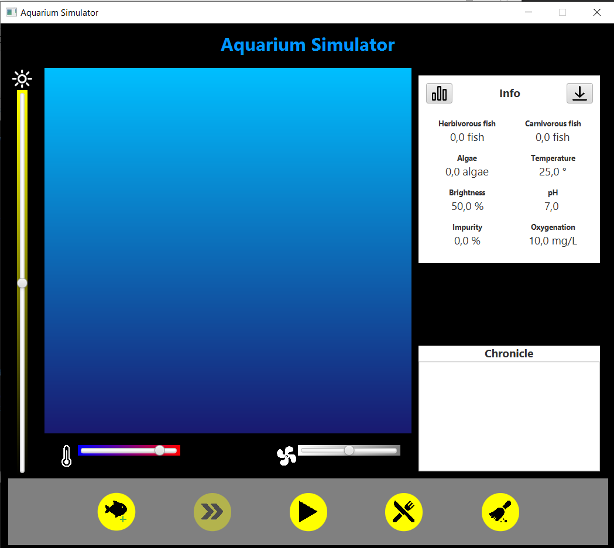
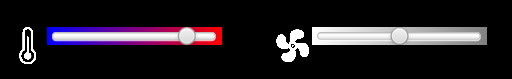
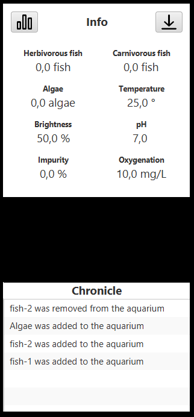

# 7 Guida utente

L'applicazione funziona su ogni dispositivo con installata una *JVM*.

Una volta scaricata e avviata ci si ritrova nella schermata principale della simulazione:

Da questa schermata è possibile interagire con la simulazione tramite alcuni controlli, raggruppabili per funzionalità:

Nella barra al di sotto della schermata di simulazione, troviamo alcuni bottoni cliccabili tramite i quali si può, rispettivamente:
- Aggiungere un pesce o un'alga: dopo aver cliccato si apre una schermata tramite la quale si può scegliere cosa inserire nell'acquario.
- Cambiare la velocità di simulazione: inizialmente impostata a velocità *normale*, cliccandoci sopra viene cambiata in *veloce*, per poi passare a *lento* e infine tornare in *normale*, creando di fatto un loop.
- Avviare o mettere in pausa: la simulazione parte in pausa, e ad ogni click lo stato verrà invertito.
- Aggiungere cibo: cliccando viene aperta una finestra attraverso la quale possiamo scegliere quale cibo inserire nell'acquario.
- Pulire l'acquario: cliccando verrà rimossa ogni traccia d'impurità.
  

Tramite gli slider ai lati della simulazione è possibile gestire alcuni parametri, quali:
- Temperatura
- Luminosità
- Ossigenazione

Sul lato destro della schermata è presente il pannello con tutte le informazioni relative all'andamento della simulazione. Partendo dal basso verso l'alto troviamo:
- Cronistoria: qui viene mostrato ogni evento della simulazione (con una breve descrizione) ordinato cronologicamente.
- Pannello delle informazioni: dove possono essere consultati tutti i parametri dell'acquario in tempo reale.
- Visualizzazione grafico: in alto a sinistra il bottone col quale è possibile visualizzare un grafico rappresentante l'andamento della popolazione nel corso della simulazione.
- Salvataggio dati: in alto a destra un bottone premuto il quale si apre una finestra che ci chiederà in quale formato vogliamo salvare i dati della simulazione su file(se in CSV o in JSON). La cartella di salvataggio è la cartella *Download*.